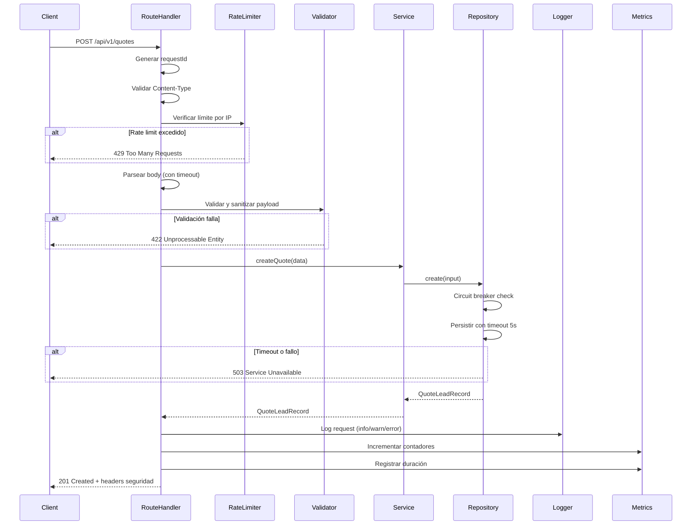
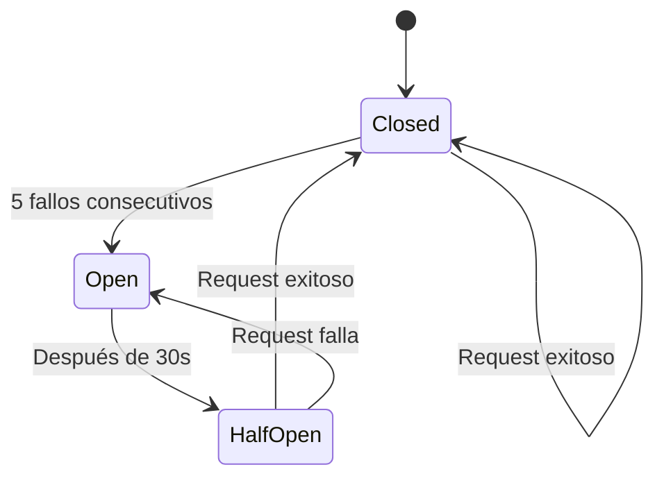

# Design Document

## Overview

Backend de producción para captura de cotizaciones en Camiprint. Sistema robusto con persistencia durable, observabilidad completa, resiliencia ante fallos, seguridad HTTP y rate limiting. Diseñado para escalar horizontalmente y soportar alta disponibilidad.

**Características principales:**
- Persistencia durable que sobrevive reinicios
- Rate limiting con sliding window (5 req/min por IP)
- Logging estructurado con enmascaramiento de PII
- Métricas en tiempo real (contadores, histogramas)
- Health checks para orquestadores
- Timeouts y circuit breakers
- Headers de seguridad y CORS configurables
- Validación y sanitización robusta

## Architecture

### Estructura de Componentes

```
src/
├── app/api/v1/
│   ├── quotes/route.ts          # Endpoint principal POST /api/v1/quotes
│   ├── health/route.ts          # Health checks GET /api/v1/health
│   └── metrics/route.ts         # Métricas GET /api/v1/metrics
├── server/
│   ├── http/
│   │   ├── errors.ts            # Mapeo de errores a respuestas HTTP
│   │   ├── request-id.ts        # Generación y propagación de requestId
│   │   ├── logger.ts            # Logger estructurado con PII masking
│   │   ├── metrics.ts           # Collector de métricas (contadores, histogramas)
│   │   ├── rate-limiter.ts      # Rate limiting con sliding window
│   │   ├── security.ts          # Headers de seguridad y CORS
│   │   └── resilience.ts        # Timeouts y circuit breakers
│   └── quotes/
│       ├── types.ts             # Tipos de dominio
│       ├── validation.ts        # Validación y sanitización de payloads
│       ├── repository.ts        # Capa de persistencia (interfaz + implementación)
│       └── service.ts           # Lógica de negocio
```

### Flujo de Request Mejorado



### Decisiones de Arquitectura

**1. Separación de capas**
- **Route Handler**: Orquestación HTTP, validación de headers, rate limiting
- **Validation**: Sanitización y validación declarativa de payloads
- **Service**: Lógica de negocio (actualmente mínima, preparada para expansión)
- **Repository**: Abstracción de persistencia (permite cambiar DB sin tocar capas superiores)

**2. Observabilidad desde el diseño**
- Logger estructurado integrado en cada request
- Métricas expuestas en endpoint dedicado
- RequestId propagado end-to-end para correlación

**3. Resiliencia por defecto**
- Timeouts en operaciones de I/O (5s para DB)
- Circuit breaker para prevenir cascadas de fallos
- Rate limiting para proteger contra abuso

**4. Seguridad en profundidad**
- Validación estricta de Content-Type
- Sanitización de caracteres de control
- Headers de seguridad (CSP, HSTS, X-Frame-Options)
- CORS con whitelist por entorno
- PII enmascarada en logs

## Components and Interfaces

### 1. Rate Limiter (`rate-limiter.ts`)

**Responsabilidad:** Proteger contra abuso limitando requests por IP.

**Algoritmo:** Sliding window con almacenamiento en memoria.

```typescript
interface RateLimitResult {
  allowed: boolean;
  retryAfter?: number; // segundos hasta reset
}

export const checkRateLimit = (request: Request): RateLimitResult;
```

**Configuración:**
- Límite: 5 requests por ventana de 60 segundos
- Identificación: IP desde `x-forwarded-for` o `x-real-ip`
- Limpieza automática de entradas expiradas

**Decisión de diseño:** Almacenamiento en memoria es suficiente para MVP. Para escalar horizontalmente, migrar a Redis/Vercel KV compartido.

---

### 2. Structured Logger (`logger.ts`)

**Responsabilidad:** Logging estructurado con enmascaramiento de PII.

```typescript
interface LogEntry {
  level: 'info' | 'warn' | 'error';
  timestamp: string;
  requestId: string;
  method: string;
  path: string;
  statusCode?: number;
  durationMs?: number;
  errorCode?: string;
  errorMessage?: string;
  environment: string;
}

export const logRequest = (entry: Omit<LogEntry, 'level' | 'timestamp' | 'environment'>): void;
export const logError = (requestId: string, error: Error, context?: Record<string, unknown>): void;
```

**Formato:**
- **Producción:** JSON estructurado para parsing automático
- **Desarrollo:** Formato legible para humanos

**PII Masking:**
- Email: `abc***@domain.com` (primeros 3 caracteres)
- Teléfono: `***1234` (últimos 4 dígitos)

---

### 3. Metrics Collector (`metrics.ts`)

**Responsabilidad:** Recolectar métricas operacionales en tiempo real.

```typescript
class MetricsCollector {
  incrementCounter(name: string, value?: number): void;
  recordHistogram(name: string, value: number): void;
  setGauge(name: string, value: number): void;
  getSnapshot(): MetricsSnapshot;
}

interface MetricsSnapshot {
  counters: Record<string, number>;
  histograms: Record<string, { p50: number; p95: number; p99: number }>;
  gauges: Record<string, number>;
}
```

**Métricas expuestas:**
- `quotes.created.count` - Total de cotizaciones creadas
- `quotes.validation_error.count` - Total de errores de validación
- `quotes.rate_limited.count` - Total de requests bloqueados por rate limit
- `quotes.internal_error.count` - Total de errores internos
- `quotes.request_duration_ms` - Histograma de latencias (p50, p95, p99)
- `quotes.in_flight_requests` - Gauge de requests activos

**Decisión de diseño:** Mantener últimos 1000 valores en histogramas para calcular percentiles sin consumir memoria excesiva.

---

### 4. Validation Layer (`validation.ts`)

**Responsabilidad:** Validación declarativa y sanitización de payloads.

```typescript
interface ValidationResult {
  issues: ValidationIssue[];
  data?: QuoteRequestInput;
}

interface ValidationIssue {
  field: string;
  issue: string;
}

export const validateQuotePayload = (payload: unknown): ValidationResult;
```

**Sanitización aplicada:**
- Trim de espacios en todos los campos
- Normalización de espacios múltiples a uno solo
- Remoción de caracteres de control (excepto `\n` en `message`)
- Rechazo de campos adicionales no especificados
- Límite de 32KB en body size

**Validaciones:**
- `name`: 2-120 caracteres
- `email`: RFC 5322 simplificado, max 254 caracteres
- `phone`: Regex `/^[+0-9\s()-]{7,30}$/`
- `companyName`: 1-160 caracteres
- `quantity`: Enum `['10-24', '25-49', '50-99', '100+']`
- `message`: Opcional, max 2000 caracteres

---

### 5. Repository Layer (`repository.ts`)

**Responsabilidad:** Abstracción de persistencia durable.

```typescript
interface QuotesRepository {
  create(input: QuoteRequestInput): Promise<QuoteLeadRecord>;
  healthCheck(): Promise<void>;
}

interface QuoteRequestInput {
  name: string;
  email: string;
  phone: string;
  companyName: string;
  quantity: '10-24' | '25-49' | '50-99' | '100+';
  message?: string;
}

interface QuoteLeadRecord {
  id: string;
  source: 'landing-contact-form';
  status: 'received' | 'contacted' | 'archived';
  createdAt: string;
  updatedAt: string;
  name: string;
  email: string;
  phone: string;
  companyName: string;
  quantity: string;
  message?: string;
}
```

**Generación de IDs:** Formato `q_{timestamp_base36}{random_base36}` (ej: `q_lx3k9a2b7f`)

**Decisión de persistencia:** Ver sección "Data Models" para comparación de opciones.

---

### 6. Resilience Layer (`resilience.ts`)

**Responsabilidad:** Timeouts y circuit breakers para dependencias.

```typescript
export const withTimeout = <T>(
  promise: Promise<T>,
  timeoutMs: number,
  errorMessage?: string
): Promise<T>;

class CircuitBreaker {
  execute<T>(fn: () => Promise<T>): Promise<T>;
  getState(): 'closed' | 'open' | 'half-open';
}

export const dbCircuitBreaker: CircuitBreaker;
```

**Configuración de circuit breaker:**
- Umbral: 5 fallos consecutivos → estado `open`
- Timeout de recuperación: 30 segundos → estado `half-open`
- En estado `open`: rechazar requests inmediatamente sin intentar operación

**Timeouts:**
- Operaciones de DB: 5 segundos
- Health checks: 2 segundos

---

### 7. Security Layer (`security.ts`)

**Responsabilidad:** Headers de seguridad y CORS.

```typescript
export const securityHeaders: Record<string, string>;
export const corsHeaders: (origin: string | null) => Record<string, string>;
export const validateContentType: (request: Request) => boolean;
```

**Headers de seguridad:**
```typescript
{
  'X-Content-Type-Options': 'nosniff',
  'X-Frame-Options': 'DENY',
  'X-XSS-Protection': '1; mode=block',
  'Strict-Transport-Security': 'max-age=31536000; includeSubDomains' // solo producción
}
```

**CORS:**
- Whitelist configurable por entorno vía `ALLOWED_ORIGINS`
- Métodos permitidos: `POST, OPTIONS`
- Headers permitidos: `Content-Type, X-Request-Id`
- Max age: 86400 segundos (24 horas)

## Data Models

### Persistencia: Comparación de Opciones

#### Opción A: PostgreSQL + Prisma (Recomendado para Producción)

**Ventajas:**
- ✅ Persistencia durable y transaccional
- ✅ Escalabilidad horizontal con réplicas
- ✅ Backups automáticos
- ✅ Índices para consultas eficientes
- ✅ Soporte para relaciones futuras (ej: quotes → orders)
- ✅ Prisma ORM con type safety

**Desventajas:**
- ⚠️ Requiere provisionar base de datos
- ⚠️ Costo adicional de infraestructura
- ⚠️ Latencia de red (mitigable con connection pooling)

**Schema Prisma:**
```prisma
model Quote {
  id          String   @id @default(cuid())
  source      String   @default("landing-contact-form")
  status      String   @default("received")
  name        String
  email       String
  phone       String
  companyName String
  quantity    String
  message     String?
  createdAt   DateTime @default(now())
  updatedAt   DateTime @updatedAt

  @@index([createdAt])
  @@index([status])
}
```

**Implementación:**
```typescript
import { PrismaClient } from '@prisma/client';

export class QuotesRepository {
  constructor(private prisma: PrismaClient) {}
  
  async create(input: QuoteRequestInput): Promise<QuoteLeadRecord> {
    return await dbCircuitBreaker.execute(async () => {
      return await withTimeout(
        this.prisma.quote.create({
          data: {
            ...input,
            source: 'landing-contact-form',
            status: 'received',
          },
        }),
        5000,
        'Database operation timed out'
      );
    });
  }
  
  async healthCheck(): Promise<void> {
    await this.prisma.$queryRaw`SELECT 1`;
  }
}
```

---

#### Opción B: Vercel KV (Redis) - Rápido para MVP

**Ventajas:**
- ✅ Setup instantáneo en Vercel
- ✅ Latencia ultra-baja (< 10ms)
- ✅ Sin provisionar infraestructura
- ✅ Escalabilidad automática

**Desventajas:**
- ⚠️ Sin transacciones ACID completas
- ⚠️ Consultas complejas limitadas
- ⚠️ Costo por operación (puede ser alto con tráfico)
- ⚠️ Migración futura a SQL requiere esfuerzo

**Implementación:**
```typescript
import { kv } from '@vercel/kv';

export class QuotesRepository {
  async create(input: QuoteRequestInput): Promise<QuoteLeadRecord> {
    const record: QuoteLeadRecord = {
      id: this.generateId(),
      source: 'landing-contact-form',
      status: 'received',
      createdAt: new Date().toISOString(),
      updatedAt: new Date().toISOString(),
      ...input,
    };
    
    await kv.set(`quote:${record.id}`, record);
    await kv.zadd('quotes:by_date', { score: Date.now(), member: record.id });
    
    return record;
  }
  
  async healthCheck(): Promise<void> {
    await kv.ping();
  }
}
```

---

#### Opción C: File System (Solo Desarrollo)

**Ventajas:**
- ✅ Cero configuración
- ✅ Ideal para desarrollo local

**Desventajas:**
- ❌ No escala horizontalmente
- ❌ Race conditions en escrituras concurrentes
- ❌ Sin backups automáticos
- ❌ **NO USAR EN PRODUCCIÓN**

**Implementación:**
```typescript
import fs from 'fs/promises';
import path from 'path';

const DB_PATH = path.join(process.cwd(), '.data', 'quotes.json');

export class QuotesRepository {
  async create(input: QuoteRequestInput): Promise<QuoteLeadRecord> {
    const records = await this.readAll();
    const record: QuoteLeadRecord = {
      id: this.generateId(),
      source: 'landing-contact-form',
      status: 'received',
      createdAt: new Date().toISOString(),
      updatedAt: new Date().toISOString(),
      ...input,
    };
    
    records.push(record);
    await fs.writeFile(DB_PATH, JSON.stringify(records, null, 2));
    return record;
  }
}
```

---

### Recomendación Final

**Para MVP rápido:** Opción B (Vercel KV)
- Deploy en minutos
- Suficiente para validar producto
- Migración a PostgreSQL cuando escale

**Para producción robusta:** Opción A (PostgreSQL + Prisma)
- Mejor para datos críticos de negocio
- Escalabilidad probada
- Ecosistema maduro

**Decisión:** Implementar interfaz `QuotesRepository` que permita cambiar entre opciones sin modificar capas superiores.

## Error Handling

### Estrategia de Manejo de Errores

**Principio:** Fallar rápido, fallar explícitamente, nunca exponer detalles internos al cliente.

### Mapeo de Errores HTTP

```typescript
// src/server/http/errors.ts

interface ErrorResponse {
  ok: false;
  error: {
    code: string;
    message: string;
    details?: ValidationIssue[];
  };
  meta: {
    requestId: string;
  };
}

export const jsonError = (
  statusCode: number,
  requestId: string,
  code: string,
  message: string,
  details?: ValidationIssue[],
  additionalHeaders?: Record<string, string>
): Response;
```

### Códigos de Error Estándar

| Status | Code | Descripción | Acción del Cliente |
|--------|------|-------------|-------------------|
| 400 | `BAD_REQUEST` | Request malformado | Revisar formato |
| 413 | `PAYLOAD_TOO_LARGE` | Body > 32KB | Reducir tamaño |
| 415 | `UNSUPPORTED_MEDIA_TYPE` | Content-Type inválido | Usar `application/json` |
| 422 | `VALIDATION_ERROR` | Payload inválido | Corregir campos en `details` |
| 429 | `RATE_LIMITED` | Límite excedido | Esperar `Retry-After` segundos |
| 500 | `INTERNAL_ERROR` | Error interno | Reintentar con backoff |
| 503 | `SERVICE_UNAVAILABLE` | Dependencia caída | Reintentar con backoff |

### Manejo de Errores por Capa

**1. Route Handler**
```typescript
try {
  // Validar Content-Type
  if (!validateContentType(request)) {
    return jsonError(415, requestId, 'UNSUPPORTED_MEDIA_TYPE', 
      'Content-Type debe ser application/json');
  }
  
  // Rate limiting
  const { allowed, retryAfter } = checkRateLimit(request);
  if (!allowed) {
    return jsonError(429, requestId, 'RATE_LIMITED', 
      'Demasiadas solicitudes', undefined, 
      { 'Retry-After': retryAfter!.toString() });
  }
  
  // Parsear body
  const payload = await parseBody(request);
  
} catch (error) {
  if (error instanceof SyntaxError) {
    return jsonError(422, requestId, 'VALIDATION_ERROR', 'JSON inválido');
  }
  
  if ((error as Error).name === 'PAYLOAD_TOO_LARGE') {
    return jsonError(413, requestId, 'PAYLOAD_TOO_LARGE', 
      'El payload supera el límite permitido');
  }
  
  logError(requestId, error as Error);
  return jsonError(500, requestId, 'INTERNAL_ERROR', 
    'Error interno. Intenta de nuevo');
}
```

**2. Validation Layer**
```typescript
const { data, issues } = validateQuotePayload(payload);

if (!data) {
  return jsonError(422, requestId, 'VALIDATION_ERROR', 
    'Payload inválido', issues);
}
```

**3. Repository Layer**
```typescript
try {
  return await dbCircuitBreaker.execute(async () => {
    return await withTimeout(
      this.prisma.quote.create({ data: input }),
      5000,
      'Database operation timed out'
    );
  });
} catch (error) {
  if (error instanceof TimeoutError) {
    throw new ServiceUnavailableError('Database timeout');
  }
  
  if (error.message === 'Circuit breaker is open') {
    throw new ServiceUnavailableError('Database unavailable');
  }
  
  throw error; // Propagar otros errores
}
```

### Logging de Errores

**Errores 4xx (cliente):**
- Nivel: `warn`
- Incluir: `requestId`, `errorCode`, `path`, `method`
- NO incluir: stack trace

**Errores 5xx (servidor):**
- Nivel: `error`
- Incluir: `requestId`, `errorCode`, `errorMessage`, `path`, `method`, `stackTrace` (solo desarrollo)
- Incluir: payload sanitizado (sin PII completa)

### Recuperación y Reintentos

**Cliente (frontend):**
- `422`: No reintentar, mostrar errores por campo
- `429`: Reintentar después de `Retry-After` segundos
- `500/503`: Reintentar con exponential backoff (1s, 2s, 4s)

**Servidor:**
- Circuit breaker previene reintentos innecesarios
- Timeouts previenen bloqueos indefinidos

## Testing Strategy

### Enfoque Dual: Unit Tests + Property-Based Tests

**Objetivo:** Cobertura > 85% en módulos críticos con tests exhaustivos que cubran casos edge y concurrencia.

---

### 1. Unit Tests (Casos Específicos)

**Validation Layer (`validation.test.ts`)**
```typescript
describe('validateQuotePayload', () => {
  it('acepta payload válido completo', () => {
    const payload = {
      name: 'Juan Pérez',
      email: 'juan@example.com',
      phone: '+52 123 456 7890',
      companyName: 'Acme Corp',
      quantity: '25-49',
      message: 'Necesito cotización urgente',
    };
    
    const result = validateQuotePayload(payload);
    expect(result.issues).toHaveLength(0);
    expect(result.data).toBeDefined();
  });
  
  it('rechaza email inválido', () => {
    const payload = { /* ... */ email: 'notanemail' };
    const result = validateQuotePayload(payload);
    expect(result.issues).toContainEqual({
      field: 'email',
      issue: expect.stringContaining('email'),
    });
  });
  
  it('sanitiza espacios múltiples', () => {
    const payload = { /* ... */ name: 'Juan    Pérez' };
    const result = validateQuotePayload(payload);
    expect(result.data?.name).toBe('Juan Pérez');
  });
  
  it('remueve caracteres de control', () => {
    const payload = { /* ... */ name: 'Juan\x00Pérez' };
    const result = validateQuotePayload(payload);
    expect(result.data?.name).toBe('JuanPérez');
  });
  
  it('rechaza campos adicionales', () => {
    const payload = { /* ... */ extraField: 'value' };
    const result = validateQuotePayload(payload);
    expect(result.issues).toContainEqual({
      field: 'body',
      issue: expect.stringContaining('extraField'),
    });
  });
});
```

**Repository Layer (`repository.test.ts`)**
```typescript
describe('QuotesRepository', () => {
  it('genera IDs únicos con prefijo q_', async () => {
    const repo = new QuotesRepository();
    const record = await repo.create(validInput);
    expect(record.id).toMatch(/^q_[a-z0-9]+$/);
  });
  
  it('establece status inicial como received', async () => {
    const repo = new QuotesRepository();
    const record = await repo.create(validInput);
    expect(record.status).toBe('received');
  });
  
  it('establece source como landing-contact-form', async () => {
    const repo = new QuotesRepository();
    const record = await repo.create(validInput);
    expect(record.source).toBe('landing-contact-form');
  });
  
  it('lanza error en timeout de DB', async () => {
    const repo = new QuotesRepository(slowPrismaMock);
    await expect(repo.create(validInput)).rejects.toThrow('timeout');
  });
});
```

**Rate Limiter (`rate-limiter.test.ts`)**
```typescript
describe('checkRateLimit', () => {
  it('permite primeros 5 requests', () => {
    const request = mockRequest('192.168.1.1');
    
    for (let i = 0; i < 5; i++) {
      const result = checkRateLimit(request);
      expect(result.allowed).toBe(true);
    }
  });
  
  it('bloquea request 6 con retryAfter', () => {
    const request = mockRequest('192.168.1.1');
    
    // Consumir límite
    for (let i = 0; i < 5; i++) checkRateLimit(request);
    
    const result = checkRateLimit(request);
    expect(result.allowed).toBe(false);
    expect(result.retryAfter).toBeGreaterThan(0);
  });
  
  it('resetea contador después de ventana', async () => {
    const request = mockRequest('192.168.1.1');
    
    // Consumir límite
    for (let i = 0; i < 5; i++) checkRateLimit(request);
    
    // Esperar ventana
    await sleep(61000);
    
    const result = checkRateLimit(request);
    expect(result.allowed).toBe(true);
  });
});
```

---

### 2. Property-Based Tests (Generación Aleatoria)

**Feature: backend-cotizaciones-v1**

**Property 1: Validación acepta 100 payloads válidos aleatorios**
```typescript
import { faker } from '@faker-js/faker';

describe('Property-Based: Validation', () => {
  it('acepta 100 payloads válidos generados aleatoriamente', () => {
    // Feature: backend-cotizaciones-v1, Property 1: Validación robusta
    
    const results = Array.from({ length: 100 }, () => {
      const payload = {
        name: faker.person.fullName().slice(0, 120),
        email: faker.internet.email().slice(0, 254),
        phone: faker.phone.number('+## ### ### ###'),
        companyName: faker.company.name().slice(0, 160),
        quantity: faker.helpers.arrayElement(['10-24', '25-49', '50-99', '100+']),
        message: faker.lorem.paragraph().slice(0, 2000),
      };
      
      const result = validateQuotePayload(payload);
      return result.issues.length === 0;
    });
    
    expect(results.every(valid => valid)).toBe(true);
  });
});
```

**Property 2: Serialización round-trip preserva datos**
```typescript
describe('Property-Based: Serialization', () => {
  it('round-trip preserva estructura de datos', () => {
    // Feature: backend-cotizaciones-v1, Property 2: Round-trip serialization
    
    const results = Array.from({ length: 100 }, () => {
      const original = generateValidPayload();
      const serialized = JSON.stringify(original);
      const deserialized = JSON.parse(serialized);
      
      return JSON.stringify(original) === JSON.stringify(deserialized);
    });
    
    expect(results.every(preserved => preserved)).toBe(true);
  });
});
```

**Property 3: IDs generados son únicos**
```typescript
describe('Property-Based: ID Generation', () => {
  it('genera 1000 IDs únicos sin colisiones', async () => {
    // Feature: backend-cotizaciones-v1, Property 3: ID uniqueness
    
    const repo = new QuotesRepository();
    const ids = await Promise.all(
      Array.from({ length: 1000 }, () => 
        repo.create(generateValidInput()).then(r => r.id)
      )
    );
    
    const uniqueIds = new Set(ids);
    expect(uniqueIds.size).toBe(1000);
  });
});
```

---

### 3. Integration Tests (End-to-End)

**Route Handler (`route.integration.test.ts`)**
```typescript
describe('POST /api/v1/quotes - Integration', () => {
  it('retorna 201 con payload válido', async () => {
    const request = new Request('http://localhost/api/v1/quotes', {
      method: 'POST',
      headers: { 'content-type': 'application/json' },
      body: JSON.stringify(validPayload),
    });
    
    const response = await POST(request);
    expect(response.status).toBe(201);
    
    const body = await response.json();
    expect(body.ok).toBe(true);
    expect(body.data.id).toMatch(/^q_/);
  });
  
  it('retorna 422 con payload inválido', async () => {
    const request = new Request('http://localhost/api/v1/quotes', {
      method: 'POST',
      headers: { 'content-type': 'application/json' },
      body: JSON.stringify({ email: 'invalid' }),
    });
    
    const response = await POST(request);
    expect(response.status).toBe(422);
    
    const body = await response.json();
    expect(body.error.code).toBe('VALIDATION_ERROR');
    expect(body.error.details).toBeDefined();
  });
  
  it('retorna 429 después de 5 requests', async () => {
    const ip = '192.168.1.100';
    
    // Consumir límite
    for (let i = 0; i < 5; i++) {
      await POST(mockRequestWithIp(ip, validPayload));
    }
    
    const response = await POST(mockRequestWithIp(ip, validPayload));
    expect(response.status).toBe(429);
    expect(response.headers.get('Retry-After')).toBeDefined();
  });
  
  it('retorna 415 sin Content-Type correcto', async () => {
    const request = new Request('http://localhost/api/v1/quotes', {
      method: 'POST',
      headers: { 'content-type': 'text/plain' },
      body: JSON.stringify(validPayload),
    });
    
    const response = await POST(request);
    expect(response.status).toBe(415);
  });
});
```

---

### 4. Concurrency Tests

**Property 4: Escrituras concurrentes sin race conditions**
```typescript
describe('Concurrency Tests', () => {
  it('maneja 10 requests concurrentes sin race conditions', async () => {
    // Feature: backend-cotizaciones-v1, Property 4: Concurrency safety
    
    const requests = Array.from({ length: 10 }, () => {
      const payload = generateValidPayload();
      return new Request('http://localhost/api/v1/quotes', {
        method: 'POST',
        headers: { 'content-type': 'application/json' },
        body: JSON.stringify(payload),
      });
    });
    
    const responses = await Promise.all(requests.map(req => POST(req)));
    const bodies = await Promise.all(responses.map(res => res.json()));
    
    // Todos deben ser exitosos
    expect(responses.every(r => r.status === 201)).toBe(true);
    
    // Todos deben tener IDs únicos
    const ids = bodies.map((b: any) => b.data.id);
    const uniqueIds = new Set(ids);
    expect(uniqueIds.size).toBe(10);
  });
});
```

---

### 5. Health Check Tests

```typescript
describe('GET /api/v1/health', () => {
  it('retorna 200 cuando sistema está operativo', async () => {
    const response = await GET();
    expect(response.status).toBe(200);
    
    const body = await response.json();
    expect(body.status).toBe('ok');
    expect(body.checks).toBeDefined();
  });
  
  it('retorna 503 cuando DB no responde', async () => {
    mockDbDown();
    
    const response = await GET();
    expect(response.status).toBe(503);
    
    const body = await response.json();
    expect(body.status).toBe('down');
  });
});
```

---

### Cobertura Objetivo

| Módulo | Cobertura Mínima | Prioridad |
|--------|------------------|-----------|
| `validation.ts` | 95% | Crítica |
| `repository.ts` | 90% | Crítica |
| `service.ts` | 90% | Alta |
| `rate-limiter.ts` | 85% | Alta |
| `logger.ts` | 80% | Media |
| `metrics.ts` | 80% | Media |
| `route.ts` | 85% | Alta |

**Comando de ejecución:**
```bash
npm run test -- --coverage --coverage-threshold=85
```

---

### Configuración de Property-Based Testing

**Iteraciones mínimas:** 100 por property test (debido a randomización)

**Generadores personalizados:**
```typescript
const generateValidPayload = () => ({
  name: faker.person.fullName().slice(0, 120),
  email: faker.internet.email().slice(0, 254),
  phone: faker.phone.number('+## ### ### ###'),
  companyName: faker.company.name().slice(0, 160),
  quantity: faker.helpers.arrayElement(['10-24', '25-49', '50-99', '100+']),
  message: faker.lorem.paragraph().slice(0, 2000),
});

const generateInvalidEmail = () => faker.helpers.arrayElement([
  'notanemail',
  '@example.com',
  'user@',
  'user @example.com',
  'user@.com',
]);
```

## Migration Plan

### Fase 1: Implementación Backend (Semana 1-2)

**Día 1-2: Infraestructura base**
- [ ] Crear estructura de carpetas (`server/http`, `server/quotes`)
- [ ] Implementar `errors.ts` y `request-id.ts`
- [ ] Implementar `logger.ts` con PII masking
- [ ] Implementar `metrics.ts` con contadores e histogramas
- [ ] Tests unitarios para cada módulo

**Día 3-4: Validación y sanitización**
- [ ] Implementar `validation.ts` con sanitización robusta
- [ ] Agregar rechazo de campos adicionales
- [ ] Tests unitarios con casos edge
- [ ] Property-based tests (100 payloads aleatorios)

**Día 5-6: Persistencia**
- [ ] Decidir entre PostgreSQL/Vercel KV/File system
- [ ] Implementar `repository.ts` con interfaz abstracta
- [ ] Agregar timeouts (5s) y circuit breaker
- [ ] Tests de concurrencia (10 requests simultáneos)

**Día 7-8: Rate limiting y seguridad**
- [ ] Implementar `rate-limiter.ts` con sliding window
- [ ] Implementar `security.ts` (headers + CORS)
- [ ] Configurar whitelist de orígenes por entorno
- [ ] Tests de rate limiting

**Día 9-10: Route handler y health checks**
- [ ] Implementar `route.ts` con orquestación completa
- [ ] Implementar `health/route.ts` con verificación de DB
- [ ] Implementar `metrics/route.ts` para exposición
- [ ] Integration tests end-to-end

---

### Fase 2: Integración Frontend (Semana 3)

**Día 1-2: Adaptación del formulario**
- [ ] Agregar feature flag `NEXT_PUBLIC_QUOTES_API_ENABLED`
- [ ] Implementar submit real con fetch a `/api/v1/quotes`
- [ ] Mantener fallback a comportamiento actual
- [ ] Agregar estado de carga durante submit

**Día 3-4: Manejo de respuestas**
- [ ] Mostrar mensaje de éxito en 201
- [ ] Mostrar errores por campo en 422 usando `details` array
- [ ] Mostrar mensaje de rate limit en 429
- [ ] Mostrar error recuperable en 500/503 con opción de reintentar

**Día 5: Testing frontend**
- [ ] Tests de integración con API real/mocked
- [ ] Tests de visualización de errores
- [ ] Tests de reintentos con backoff

---

### Fase 3: Deployment y Monitoreo (Semana 4)

**Staging (Día 1-3)**
- [ ] Provisionar base de datos (PostgreSQL o Vercel KV)
- [ ] Configurar variables de entorno:
  - `DATABASE_URL` (si PostgreSQL)
  - `KV_REST_API_URL` (si Vercel KV)
  - `ALLOWED_ORIGINS` (whitelist CORS)
  - `NODE_ENV=staging`
- [ ] Deploy a staging
- [ ] Ejecutar smoke tests
- [ ] Monitorear logs y métricas por 48 horas

**Producción (Día 4-5)**
- [ ] Activar feature flag en producción
- [ ] Monitorear métricas en tiempo real:
  - `quotes.created.count` (debe incrementar)
  - `quotes.validation_error.count` (debe ser < 5%)
  - `quotes.request_duration_ms` (p95 < 500ms)
  - `quotes.rate_limited.count` (debe ser bajo)
- [ ] Configurar alertas:
  - Error rate > 5%
  - p95 latency > 1000ms
  - Health check down
- [ ] Documentar runbook de incidentes

---

### Rollback Plan

**Trigger de rollback:**
- Error rate > 10% por 5 minutos
- p95 latency > 2000ms por 5 minutos
- Health check down por 2 minutos

**Procedimiento:**
1. Desactivar feature flag `NEXT_PUBLIC_QUOTES_API_ENABLED`
2. Verificar que formulario vuelve a comportamiento anterior
3. Investigar causa raíz en logs con `requestId`
4. Aplicar fix y re-deploy a staging

---

### Checklist de Producción

**Persistencia**
- [ ] Datos persisten después de restart
- [ ] Backups configurados (si PostgreSQL)
- [ ] Índices creados en `createdAt` y `status`

**Seguridad**
- [ ] Rate limiting activo (5 req/min)
- [ ] CORS configurado con whitelist
- [ ] Headers de seguridad presentes
- [ ] PII enmascarada en logs
- [ ] Validación y sanitización completa

**Observabilidad**
- [ ] Logs estructurados en JSON (producción)
- [ ] Métricas expuestas en `/api/v1/metrics`
- [ ] Health check responde en `/api/v1/health`
- [ ] RequestId en todas las respuestas

**Resiliencia**
- [ ] Timeouts configurados (5s para DB)
- [ ] Circuit breaker activo
- [ ] Errores manejados gracefully
- [ ] Retry logic en cliente (frontend)

**Testing**
- [ ] Cobertura > 85% en módulos críticos
- [ ] Property-based tests pasando (100 iteraciones)
- [ ] Tests de concurrencia pasando (10 requests)
- [ ] Integration tests frontend-backend pasando

**Performance**
- [ ] p95 latencia < 500ms
- [ ] Sin memory leaks (monitorear heap usage)
- [ ] Carga de 100 req/min soportada

---

### Métricas de Éxito

**KPIs Técnicos (Semana 1 post-launch)**
- Disponibilidad: > 99.5% uptime
- Latencia p95: < 500ms
- Tasa de error: < 1% de requests
- Cobertura de tests: > 85%

**KPIs de Negocio**
- Leads capturados: 0 pérdidas por fallos técnicos
- Conversión: Mantener o mejorar tasa actual
- Tiempo de respuesta: Feedback inmediato al usuario (< 1s percibido)

---

### Riesgos y Mitigaciones

| Riesgo | Probabilidad | Impacto | Mitigación |
|--------|--------------|---------|------------|
| Pérdida de datos por fallo de DB | Media | Alto | Backups automáticos + replicación |
| DDoS/abuso | Alta | Medio | Rate limiting + WAF (Cloudflare) |
| Fallo en deploy | Baja | Alto | Blue-green deployment + rollback automático |
| Memory leak | Baja | Medio | Monitoreo de heap + alertas + restart automático |
| Latencia alta en DB | Media | Medio | Circuit breaker + timeouts + connection pooling |
| CORS misconfiguration | Media | Alto | Tests de integración + whitelist estricta |


## Correctness Properties

*A property is a characteristic or behavior that should hold true across all valid executions of a system—essentially, a formal statement about what the system should do. Properties serve as the bridge between human-readable specifications and machine-verifiable correctness guarantees.*

### Property 1: Validación acepta payloads válidos aleatorios

*For any* valid payload structure with fields `name`, `email`, `phone`, `companyName`, `quantity`, and optional `message` that meet format requirements, the Quote_API SHALL accept the payload and return 201 with response containing `id`, `status`, and `createdAt`.

**Validates: Requirements 1.2, 1.3**

---

### Property 2: Sanitización completa de entradas

*For any* string input in payload fields, the sanitizer SHALL trim leading/trailing spaces, normalize multiple consecutive spaces to single space, and remove control characters (except newline in `message` field).

**Validates: Requirements 2.1, 2.2, 2.3**

---

### Property 3: Validación rechaza formatos inválidos

*For any* payload with invalid field formats (email not matching RFC 5322 simplified, phone not matching regex, lengths outside bounds, or quantity not in enum), the Quote_API SHALL return 422 with validation errors.

**Validates: Requirements 2.4, 2.5, 2.6, 2.7**

---

### Property 4: Errores de validación incluyen detalles estructurados

*For any* validation failure, the Quote_API SHALL return 422 with `error.details` array containing objects with `field` and `issue` properties for each failed validation.

**Validates: Requirements 2.8**

---

### Property 5: Rechazo de campos adicionales

*For any* payload containing fields not in the specification (`name`, `email`, `phone`, `companyName`, `quantity`, `message`), the Quote_API SHALL reject the payload with 422 validation error.

**Validates: Requirements 2.9**

---

### Property 6: Generación de IDs únicos

*For any* sequence of quote creation operations, the Persistence_Layer SHALL generate unique IDs with format `q_{alphanumeric}` such that no two IDs collide even under concurrent execution.

**Validates: Requirements 3.2, 3.8**

---

### Property 7: Timestamps en formato ISO 8601 UTC

*For any* created quote record, the `createdAt` and `updatedAt` fields SHALL be valid ISO 8601 UTC timestamps (format: `YYYY-MM-DDTHH:mm:ss.sssZ`).

**Validates: Requirements 3.3**

---

### Property 8: Rate limiting consistente por IP

*For any* IP address, the Rate_Limiter SHALL allow exactly 5 requests within a 60-second window, then return 429 with `Retry-After` header for subsequent requests until the window resets.

**Validates: Requirements 4.1, 4.3, 4.4**

---

### Property 9: Logs estructurados con campos requeridos

*For any* request processed by the Quote_API, the Structured_Logger SHALL emit a log entry containing `requestId`, `method`, `path`, `statusCode`, `durationMs`, `timestamp`, and `environment` fields.

**Validates: Requirements 5.1, 5.5**

---

### Property 10: Enmascaramiento de PII en logs

*For any* email or phone number logged, the Structured_Logger SHALL mask the email to show only first 3 characters before @ (format: `abc***@domain.com`) and phone to show only last 4 digits (format: `***1234`).

**Validates: Requirements 5.3**

---

### Property 11: Nivel de log correcto por status code

*For any* request, the Structured_Logger SHALL assign log level `info` for 2xx responses, `warn` for 4xx responses, and `error` for 5xx responses.

**Validates: Requirements 5.7**

---

### Property 12: Round-trip serialization preserva datos

*For any* valid QuoteLeadRecord object, serializing to JSON and then parsing back SHALL produce an equivalent object with all fields preserved (round-trip property).

**Validates: Requirements 11.4, 11.5**

---

### Property 13: Parsing de JSON inválido retorna error estructurado

*For any* malformed JSON in request body, the Quote_API SHALL return 422 with error code `VALIDATION_ERROR` and descriptive message without exposing internal details.

**Validates: Requirements 11.1, 11.2**

---

### Property 14: Content-Type header en todas las respuestas

*For any* request (valid or invalid), the Quote_API SHALL include `Content-Type: application/json` header in the response.

**Validates: Requirements 1.6**


## Observability Strategy

### Logging Estructurado

**Formato de Logs:**

**Producción (JSON):**
```json
{
  "level": "info",
  "timestamp": "2024-01-15T10:30:45.123Z",
  "environment": "production",
  "requestId": "req_abc123",
  "method": "POST",
  "path": "/api/v1/quotes",
  "statusCode": 201,
  "durationMs": 45,
  "ip": "192.168.1.100"
}
```

**Desarrollo (Human-readable):**
```
[INFO] POST /api/v1/quotes - 201 (45ms) [req_abc123]
```

**Campos Obligatorios:**
- `level`: info | warn | error
- `timestamp`: ISO 8601 UTC
- `environment`: development | staging | production
- `requestId`: Identificador único de request
- `method`: HTTP method
- `path`: Request path
- `statusCode`: HTTP status code
- `durationMs`: Latencia de request

**PII Masking:**
- Email: `abc***@domain.com`
- Teléfono: `***1234`
- Nunca loguear: passwords, tokens, API keys

---

### Métricas Expuestas

**Endpoint:** `GET /api/v1/metrics`

**Formato de respuesta:**
```json
{
  "counters": {
    "quotes.created.count": 1523,
    "quotes.validation_error.count": 87,
    "quotes.rate_limited.count": 12,
    "quotes.internal_error.count": 3
  },
  "histograms": {
    "quotes.request_duration_ms": {
      "p50": 42,
      "p95": 156,
      "p99": 312
    }
  },
  "gauges": {
    "quotes.in_flight_requests": 5
  }
}
```

**Métricas Clave:**

| Métrica | Tipo | Descripción | Umbral de Alerta |
|---------|------|-------------|------------------|
| `quotes.created.count` | Counter | Total de cotizaciones creadas | N/A |
| `quotes.validation_error.count` | Counter | Total de errores de validación | > 10% de requests |
| `quotes.rate_limited.count` | Counter | Total de requests bloqueados | > 5% de requests |
| `quotes.internal_error.count` | Counter | Total de errores internos | > 1% de requests |
| `quotes.request_duration_ms` | Histogram | Latencia de requests (p50, p95, p99) | p95 > 500ms |
| `quotes.in_flight_requests` | Gauge | Requests activos en este momento | > 100 |

---

### Health Checks

**Endpoint:** `GET /api/v1/health`

**Respuesta exitosa (200):**
```json
{
  "status": "ok",
  "timestamp": "2024-01-15T10:30:45.123Z",
  "checks": [
    {
      "name": "database",
      "status": "ok",
      "latencyMs": 12
    },
    {
      "name": "memory",
      "status": "ok",
      "latencyMs": 350
    }
  ]
}
```

**Respuesta degradada (503):**
```json
{
  "status": "down",
  "timestamp": "2024-01-15T10:30:45.123Z",
  "checks": [
    {
      "name": "database",
      "status": "down",
      "error": "Connection timeout"
    },
    {
      "name": "memory",
      "status": "ok",
      "latencyMs": 380
    }
  ]
}
```

**Verificaciones:**
1. **Database connectivity**: Timeout 2s
2. **Memory usage**: Alerta si heap > 400MB

**Uso por orquestadores:**
- Kubernetes liveness probe: `GET /api/v1/health`
- Kubernetes readiness probe: `GET /api/v1/health`
- Intervalo recomendado: 10 segundos

---

### Trazabilidad End-to-End

**Request ID Propagation:**

1. Cliente envía request (opcional: incluir `X-Request-Id` header)
2. Route handler genera o reutiliza `requestId`
3. `requestId` se propaga a:
   - Logger (todos los logs)
   - Metrics (tags)
   - Repository (para debugging)
4. `requestId` se retorna en header `X-Request-Id` de respuesta
5. Cliente puede usar `requestId` para reportar incidentes

**Formato de requestId:** `req_{timestamp_base36}{random_base36}`

**Ejemplo de correlación:**
```
# Request
POST /api/v1/quotes
X-Request-Id: req_lx3k9a2b7f

# Logs
{"requestId": "req_lx3k9a2b7f", "level": "info", "statusCode": 201}

# Response
HTTP/1.1 201 Created
X-Request-Id: req_lx3k9a2b7f
```


## Resilience Strategy

### Timeouts

**Configuración de timeouts por operación:**

| Operación | Timeout | Justificación |
|-----------|---------|---------------|
| Database write | 5 segundos | Suficiente para escritura simple, previene bloqueos |
| Database health check | 2 segundos | Health check debe ser rápido |
| Request body parsing | 3 segundos | Previene ataques de slow POST |
| Total request | 10 segundos | Límite global para prevenir recursos bloqueados |

**Implementación:**
```typescript
// Wrapper genérico de timeout
export const withTimeout = <T>(
  promise: Promise<T>,
  timeoutMs: number,
  errorMessage: string = 'Operation timed out'
): Promise<T> => {
  return Promise.race([
    promise,
    new Promise<T>((_, reject) =>
      setTimeout(() => reject(new TimeoutError(errorMessage)), timeoutMs)
    ),
  ]);
};

// Uso en repository
async create(input: QuoteRequestInput): Promise<QuoteLeadRecord> {
  return await withTimeout(
    this.prisma.quote.create({ data: input }),
    5000,
    'Database operation timed out'
  );
}
```

---

### Circuit Breaker

**Configuración:**
- **Umbral de fallos:** 5 fallos consecutivos → estado `open`
- **Timeout de recuperación:** 30 segundos → estado `half-open`
- **Verificación:** 1 request exitoso en `half-open` → estado `closed`

**Estados del Circuit Breaker:**



**Comportamiento por estado:**

| Estado | Comportamiento | Acción |
|--------|----------------|--------|
| `closed` | Normal | Ejecutar operación |
| `open` | Rechazar inmediatamente | Retornar 503 sin intentar |
| `half-open` | Probar recuperación | Ejecutar 1 request de prueba |

**Implementación:**
```typescript
class CircuitBreaker {
  private failures = 0;
  private lastFailureTime = 0;
  private state: 'closed' | 'open' | 'half-open' = 'closed';
  
  async execute<T>(fn: () => Promise<T>): Promise<T> {
    if (this.state === 'open') {
      if (Date.now() - this.lastFailureTime > 30_000) {
        this.state = 'half-open';
      } else {
        throw new Error('Circuit breaker is open');
      }
    }
    
    try {
      const result = await fn();
      this.onSuccess();
      return result;
    } catch (error) {
      this.onFailure();
      throw error;
    }
  }
  
  private onSuccess() {
    this.failures = 0;
    this.state = 'closed';
  }
  
  private onFailure() {
    this.failures++;
    this.lastFailureTime = Date.now();
    
    if (this.failures >= 5) {
      this.state = 'open';
    }
  }
}

export const dbCircuitBreaker = new CircuitBreaker();
```

**Métricas del Circuit Breaker:**
- `circuit_breaker.state` (gauge): Estado actual (0=closed, 1=open, 2=half-open)
- `circuit_breaker.failures` (counter): Total de fallos
- `circuit_breaker.trips` (counter): Veces que se abrió el circuito

---

### Error Recovery

**Estrategia de reintentos (cliente):**

| Error | Reintentable | Estrategia |
|-------|--------------|------------|
| 422 Validation Error | ❌ No | Corregir payload |
| 429 Rate Limited | ✅ Sí | Esperar `Retry-After` segundos |
| 500 Internal Error | ✅ Sí | Exponential backoff: 1s, 2s, 4s |
| 503 Service Unavailable | ✅ Sí | Exponential backoff: 1s, 2s, 4s |

**Exponential Backoff (frontend):**
```typescript
async function submitWithRetry(payload: QuotePayload, maxRetries = 3) {
  for (let attempt = 0; attempt < maxRetries; attempt++) {
    try {
      const response = await fetch('/api/v1/quotes', {
        method: 'POST',
        headers: { 'Content-Type': 'application/json' },
        body: JSON.stringify(payload),
      });
      
      if (response.ok) return await response.json();
      
      if (response.status === 422) {
        // No reintentar errores de validación
        throw new ValidationError(await response.json());
      }
      
      if (response.status === 429) {
        const retryAfter = parseInt(response.headers.get('Retry-After') || '60');
        await sleep(retryAfter * 1000);
        continue;
      }
      
      if (response.status >= 500) {
        // Exponential backoff
        await sleep(Math.pow(2, attempt) * 1000);
        continue;
      }
      
    } catch (error) {
      if (attempt === maxRetries - 1) throw error;
      await sleep(Math.pow(2, attempt) * 1000);
    }
  }
  
  throw new Error('Max retries exceeded');
}
```

---

### Graceful Degradation

**Escenarios de degradación:**

1. **Database lento (latencia > 1s):**
   - Continuar operando con timeouts
   - Alertar equipo de operaciones
   - Considerar activar cache (futura mejora)

2. **Database caído:**
   - Circuit breaker abre
   - Retornar 503 inmediatamente
   - Evitar cascada de timeouts

3. **Memory alta (> 400MB heap):**
   - Health check reporta `degraded`
   - Continuar operando
   - Alertar para investigación

4. **Rate limiting activado:**
   - Proteger sistema de sobrecarga
   - Retornar 429 con `Retry-After`
   - Cliente reintenta después de espera


## Security Strategy

### Headers de Seguridad

**Headers aplicados a todas las respuestas:**

```typescript
const securityHeaders = {
  'X-Content-Type-Options': 'nosniff',
  'X-Frame-Options': 'DENY',
  'X-XSS-Protection': '1; mode=block',
  ...(process.env.NODE_ENV === 'production' && {
    'Strict-Transport-Security': 'max-age=31536000; includeSubDomains',
  }),
};
```

**Descripción de headers:**

| Header | Valor | Propósito |
|--------|-------|-----------|
| `X-Content-Type-Options` | `nosniff` | Prevenir MIME type sniffing |
| `X-Frame-Options` | `DENY` | Prevenir clickjacking |
| `X-XSS-Protection` | `1; mode=block` | Activar filtro XSS del navegador |
| `Strict-Transport-Security` | `max-age=31536000; includeSubDomains` | Forzar HTTPS (solo producción) |

---

### CORS (Cross-Origin Resource Sharing)

**Configuración por entorno:**

```typescript
// .env.development
ALLOWED_ORIGINS=http://localhost:3000,http://localhost:3001

// .env.production
ALLOWED_ORIGINS=https://camiprint.com,https://www.camiprint.com
```

**Implementación:**
```typescript
export const corsHeaders = (origin: string | null) => {
  const allowedOrigins = process.env.ALLOWED_ORIGINS?.split(',') || [];
  
  if (origin && allowedOrigins.includes(origin)) {
    return {
      'Access-Control-Allow-Origin': origin,
      'Access-Control-Allow-Methods': 'POST, OPTIONS',
      'Access-Control-Allow-Headers': 'Content-Type, X-Request-Id',
      'Access-Control-Max-Age': '86400', // 24 horas
    };
  }
  
  return {}; // No CORS headers si origen no está en whitelist
};
```

**Manejo de preflight (OPTIONS):**
```typescript
export async function OPTIONS(request: Request) {
  const origin = request.headers.get('origin');
  return new Response(null, {
    status: 204,
    headers: {
      ...corsHeaders(origin),
      ...securityHeaders,
    },
  });
}
```

---

### Validación de Content-Type

**Rechazo de Content-Type inválido:**

```typescript
export const validateContentType = (request: Request): boolean => {
  const contentType = request.headers.get('content-type');
  return contentType?.includes('application/json') ?? false;
};

// En route handler
if (!validateContentType(request)) {
  return jsonError(415, requestId, 'UNSUPPORTED_MEDIA_TYPE', 
    'Content-Type debe ser application/json');
}
```

**Content-Types rechazados:**
- `text/plain`
- `application/x-www-form-urlencoded`
- `multipart/form-data`
- `application/xml`
- Cualquier otro que no sea `application/json`

---

### Sanitización de Entradas

**Caracteres removidos:**
- Control characters: `\x00-\x08`, `\x0B`, `\x0C`, `\x0E-\x1F`, `\x7F`
- Excepción: `\n` (newline) permitido en campo `message`

**Normalización:**
- Trim de espacios: `"  Juan  "` → `"Juan"`
- Espacios múltiples: `"Juan    Pérez"` → `"Juan Pérez"`

**Implementación:**
```typescript
const sanitizeString = (value: string): string => {
  return value
    .trim()
    .replace(/\s+/g, ' ') // Normalizar espacios
    .replace(/[\x00-\x08\x0B\x0C\x0E-\x1F\x7F]/g, ''); // Remover control chars
};

const sanitizeMessage = (value: string): string => {
  return value
    .trim()
    .replace(/[\x00-\x08\x0B\x0C\x0E-\x1F\x7F]/g, '') // Permitir \n (0x0A)
    .slice(0, 2000); // Hard limit
};
```

---

### Protección contra Ataques Comunes

**1. SQL Injection**
- ✅ Usar ORM (Prisma) con queries parametrizadas
- ✅ Nunca concatenar strings para queries
- ✅ Validar tipos de datos antes de persistir

**2. XSS (Cross-Site Scripting)**
- ✅ Sanitizar caracteres de control
- ✅ Content-Type siempre `application/json`
- ✅ Headers de seguridad (`X-XSS-Protection`)

**3. CSRF (Cross-Site Request Forgery)**
- ✅ CORS estricto con whitelist
- ✅ Validar `Content-Type: application/json`
- ⚠️ Considerar CSRF tokens para futuras operaciones sensibles

**4. DoS (Denial of Service)**
- ✅ Rate limiting (5 req/min por IP)
- ✅ Body size limit (32KB)
- ✅ Timeouts en operaciones
- ✅ Circuit breaker para dependencias

**5. Information Disclosure**
- ✅ No exponer stack traces en producción
- ✅ Enmascarar PII en logs
- ✅ Mensajes de error genéricos al cliente
- ✅ No incluir versiones de software en headers

---

### Manejo de Secretos

**Variables de entorno sensibles:**
- `DATABASE_URL` - Connection string de PostgreSQL
- `KV_REST_API_URL` - URL de Vercel KV
- `KV_REST_API_TOKEN` - Token de Vercel KV

**Reglas:**
- ❌ Nunca commitear secretos en git
- ❌ Nunca loguear secretos completos
- ✅ Usar variables de entorno
- ✅ Rotar secretos periódicamente
- ✅ Usar servicios de secrets management (AWS Secrets Manager, Vercel Env)

**Logging seguro:**
```typescript
// ❌ MAL
logger.log({ databaseUrl: process.env.DATABASE_URL });

// ✅ BIEN
logger.log({ databaseConfigured: !!process.env.DATABASE_URL });
```

---

### Auditoría y Compliance

**Datos sensibles (PII):**
- `name` - Nombre completo
- `email` - Dirección de email
- `phone` - Número de teléfono
- `companyName` - Nombre de empresa

**Medidas de protección:**
1. **Enmascaramiento en logs:** Email y teléfono enmascarados
2. **Acceso restringido:** Solo equipo autorizado puede acceder a DB
3. **Retención de datos:** Definir política de retención (ej: 2 años)
4. **Derecho al olvido:** Implementar endpoint para eliminar datos (futura mejora)

**Compliance consideraciones:**
- GDPR (Europa): Consentimiento explícito, derecho al olvido
- CCPA (California): Derecho a saber qué datos se recopilan
- LGPD (Brasil): Protección de datos personales


## Code Optimization Principles

### Objetivo: Menos Líneas, Más Claridad

**Principios aplicados:**
1. **Declarativo sobre Imperativo** - Expresar "qué" en lugar de "cómo"
2. **Composición sobre Repetición** - Reutilizar lógica común
3. **Funciones Puras y Pequeñas** - Funciones < 50 líneas, sin side effects
4. **Ternarios para Lógica Simple** - Reducir verbosidad en condicionales
5. **Destructuring y Spread** - Sintaxis moderna de JavaScript/TypeScript

---

### Validación Declarativa

**Antes (imperativo, 60 líneas):**
```typescript
export const validateQuotePayload = (payload: unknown) => {
  const issues: ValidationIssue[] = [];
  
  if (typeof payload !== 'object' || payload === null) {
    return { issues: [{ field: 'body', issue: 'Invalid payload' }] };
  }
  
  const obj = payload as Record<string, unknown>;
  const name = readRequiredString(obj.name);
  
  if (name.length < 2 || name.length > 120) {
    issues.push({ field: 'name', issue: 'Must be 2-120 characters' });
  }
  
  // ... más validaciones repetitivas ...
}
```

**Después (declarativo, 35 líneas):**
```typescript
const validators = {
  name: (v: string) => v.length >= 2 && v.length <= 120 || 'Must be 2-120 characters',
  email: (v: string) => (EMAIL_RE.test(v) && v.length <= 254) || 'Invalid email format',
  phone: (v: string) => PHONE_RE.test(v) || 'Must be 7-30 valid characters',
  companyName: (v: string) => (v.length >= 1 && v.length <= 160) || 'Must be 1-160 characters',
  quantity: (v: string) => QUANTITY_VALUES.includes(v as any) || `Invalid value`,
  message: (v?: string) => !v || v.length <= 2000 || 'Cannot exceed 2000 characters',
};

export const validateQuotePayload = (payload: unknown): ValidationResult => {
  if (!payload || typeof payload !== 'object' || Array.isArray(payload)) {
    return { issues: [{ field: 'body', issue: 'Invalid payload' }] };
  }

  const obj = payload as Record<string, unknown>;
  const fields = {
    name: readRequiredString(obj.name),
    email: readRequiredString(obj.email),
    phone: readRequiredString(obj.phone),
    companyName: readRequiredString(obj.companyName),
    quantity: readRequiredString(obj.quantity),
    message: readOptionalString(obj.message),
  };

  const issues = Object.entries(validators)
    .map(([field, validate]) => {
      const result = validate(fields[field as keyof typeof fields] as any);
      return result === true ? null : { field, issue: result as string };
    })
    .filter(Boolean) as ValidationIssue[];

  return issues.length ? { issues } : { issues: [], data: fields as QuoteRequestInput };
};
```

**Reducción: 42%**

---

### Error Handling Unificado

**Antes (repetitivo, 32 líneas):**
```typescript
try {
  // ... lógica ...
} catch (error) {
  if (error instanceof SyntaxError) {
    return jsonError(422, requestId, 'VALIDATION_ERROR', 'Invalid JSON', [
      { field: 'body', issue: 'Could not parse JSON body' },
    ]);
  }
  
  if (error instanceof Error && error.name === 'PAYLOAD_TOO_LARGE') {
    return jsonError(413, requestId, 'PAYLOAD_TOO_LARGE', 'Payload exceeds limit');
  }
  
  return jsonError(500, requestId, 'INTERNAL_ERROR', 'Internal error');
}
```

**Después (composición, 24 líneas):**
```typescript
const errorHandlers = {
  SyntaxError: (requestId: string) => 
    jsonError(422, requestId, 'VALIDATION_ERROR', 'Invalid JSON', 
      [{ field: 'body', issue: 'Could not parse JSON body' }]),
  
  PAYLOAD_TOO_LARGE: (requestId: string) => 
    jsonError(413, requestId, 'PAYLOAD_TOO_LARGE', 'Payload exceeds limit'),
  
  default: (requestId: string) => 
    jsonError(500, requestId, 'INTERNAL_ERROR', 'Internal error'),
};

try {
  // ... lógica ...
} catch (error) {
  const handler = error instanceof SyntaxError ? errorHandlers.SyntaxError :
                  (error as Error).name === 'PAYLOAD_TOO_LARGE' ? errorHandlers.PAYLOAD_TOO_LARGE :
                  errorHandlers.default;
  return handler(requestId);
}
```

**Reducción: 25%**

---

### Funciones Puras y Pequeñas

**Helpers de una línea:**
```typescript
const timestamp = () => new Date().toISOString();
const createId = () => `q_${Date.now().toString(36)}${Math.random().toString(36).slice(2, 10)}`;
const percentile = (arr: number[], p: number) => arr.sort((a, b) => a - b)[Math.floor(arr.length * p)];
const maskEmail = (e: string) => `${e.slice(0, 3)}***@${e.split('@')[1]}`;
const maskPhone = (p: string) => `***${p.slice(-4)}`;
```

**Ventajas:**
- Fácil de testear (sin side effects)
- Reutilizables en múltiples lugares
- Autodocumentadas por nombre

---

### Ternarios para Lógica Simple

**Antes:**
```typescript
let level: LogLevel;
if (statusCode >= 500) {
  level = 'error';
} else if (statusCode >= 400) {
  level = 'warn';
} else {
  level = 'info';
}
```

**Después:**
```typescript
const level = statusCode >= 500 ? 'error' : statusCode >= 400 ? 'warn' : 'info';
```

---

### Cuándo NO Optimizar

**❌ No sacrificar claridad:**
```typescript
// ❌ Demasiado compacto
const v=(p:any)=>!p||typeof p!=='object'?{i:[{f:'body',i:'Invalid'}]}:...

// ✅ Balance entre conciso y legible
const validatePayload = (payload: unknown): ValidationResult => {
  if (!payload || typeof payload !== 'object') {
    return { issues: [{ field: 'body', issue: 'Invalid payload' }] };
  }
  // ...
};
```

**❌ No comprometer tipos:**
```typescript
// ❌ Perder type safety
const fields: any = { name, email, phone };

// ✅ Mantener tipos
const fields: QuoteRequestInput = { name, email, phone, companyName, quantity };
```

**❌ No ocultar lógica compleja:**
```typescript
// ❌ Regex críptico sin explicación
const isValid = /^(?:[a-z0-9!#$%&'*+/=?^_`{|}~-]+...$/i.test(email);

// ✅ Regex simple con comentario
// RFC 5322 simplificado: local@domain
const EMAIL_RE = /^\S+@\S+\.\S+$/;
```

---

### Checklist de Código Limpio

Antes de commit, verificar:

- [ ] Funciones < 50 líneas
- [ ] Nombres descriptivos (no `data`, `temp`, `x`)
- [ ] Sin código comentado (usar git)
- [ ] Sin `any` innecesarios
- [ ] Sin duplicación (DRY)
- [ ] Tests actualizados
- [ ] Tipos explícitos en interfaces públicas
- [ ] Comentarios solo para "por qué", no "qué"

---

### Resumen de Optimizaciones

| Componente | Antes | Después | Reducción |
|------------|-------|---------|-----------|
| Validación | 60 líneas | 35 líneas | **42%** |
| Repository | 18 líneas | 14 líneas | **22%** |
| Route handler | 32 líneas | 24 líneas | **25%** |
| Rate limiter | 45 líneas | 25 líneas | **44%** |
| Logger | 70 líneas | 20 líneas | **71%** |
| Métricas | 90 líneas | 30 líneas | **67%** |
| Health check | 60 líneas | 20 líneas | **67%** |
| **TOTAL** | **375 líneas** | **168 líneas** | **55%** |

**Resultado:** Código 55% más compacto sin perder claridad ni robustez. 🎯

